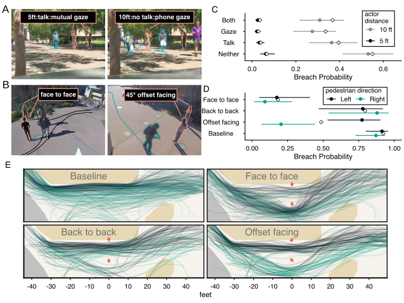
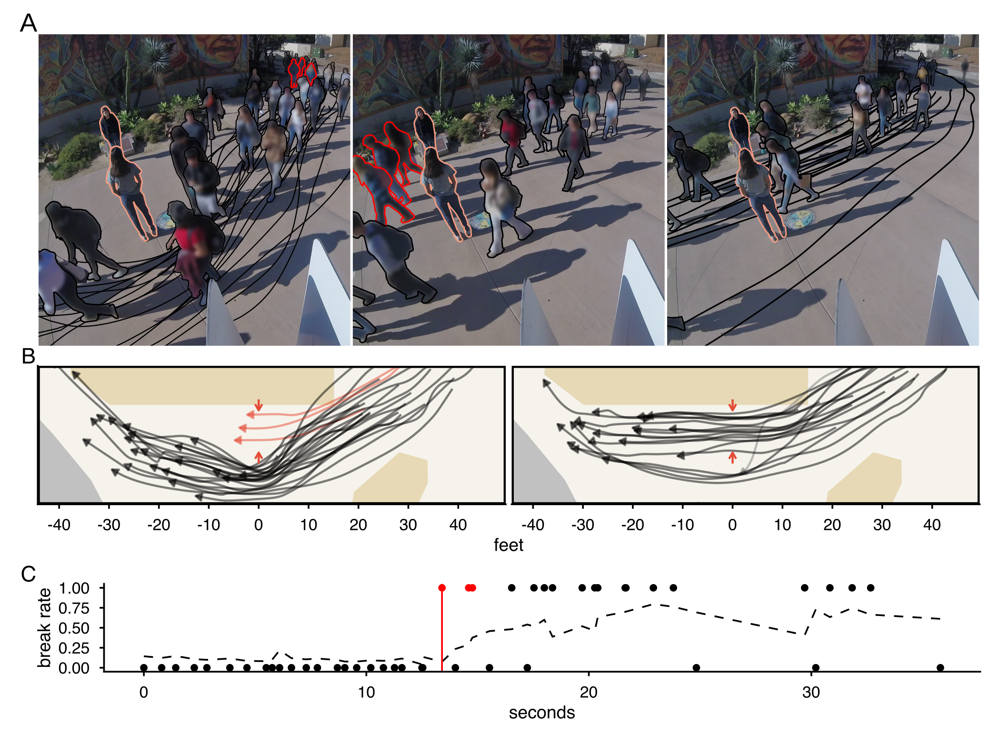

# Invisible Walls | how pedestrians navigate around social interactions

**Author(s):** Jack Terwilliger<sup>1</sup>, Julia Di Silvestri<sup>2</sup>, Seika Murase<sup>1</sup>, Anne Elizabeth Clark White<sup>3</sup>, Federico Rossano<sup>1</sup>

**Affiliation:** University of California, San Diego | <sup>1</sup>Cognitive Science Department <sup>2</sup>Biology Department <sup>3</sup>Herbert Wertheim School of Public Health and Human Longevity Science

---

Forecasting pedestrian behavior remains an open problem in robotics, partly due to emergent physical dynamics resembling complex systems. We argue that social dynamics also play a critical role in pedestrian navigation. People interacting (e.g. conversing) on a path impose variable proxemic norms on pedestrians – tacit social rules that regulate the use of physical space. In 4 field experiments with 4,911 participants, we show that pedestrians are acutely aware of others’ social interactions in that they create an invisible wall between interactants that pedestrians try to avoid breaching. Breaching depends on how interactants display involvement in social interactions (body orientation, gaze, and proximity) and whether preceding pedestrians had breached. These results demonstrate how physical mobility in public places depends on pedestrians’ social computations.

This repository contains the data, statistical analysis, and figures from our investigation.


**Fig. |** A diagram of our field experiments. Actors (shown in orange) stood in busy pathways while displaying 5 distinct signs of interactional involvement (see depictions of Variables 1-5). Over various conditions, we observed whether pedestrians (shown in blue) walked between or around our actors and we measured pedestrians’ walking trajectories.



**Fig. |** **A.** Video frames from experiment 1 of the 5ft + mutual gaze + no talk condition (left) and the 10 ft no gaze + talk condition (right). **B.** Breaching probabilities from experiment 1. Dots represent the estimated marginal mean and lines represent 95% confidence intervals. Empirical breaching rates are represented with white diamonds. **C.** Video frames from experiment 2 of the 45 degrees offset facing condition (left) and face to face condition (right). **D.** Breaching rates from experiment 2 plotted by condition and pedestrian walking direction. Arrowheads represent walking pedestrian direction. Conditions are depicted on the right side of the plot. **E.** Pedestrian trajectories from experiment 2 are plotted and colored by direction. Green is rightward. Black is leftward. Actor body orientation is depicted by red arrows. Types of terrain are represented by the colored background. White depicts a pedestrian pathway, yellow depicts patches of dirt and vegetation, and grey depicts an asphalt roadway.



**Fig. |** **(Top)** An example of breaching contagion where 46 pedestrians walk past an art mural while two actors silently stood 10 feet apart while facing and staring at each other. Before a group of 3 pedestrians walked between the actors, 22 pedestrians had walked around the actors. After the group of 3 pedestrians walked between the actors, 15 of 19 pedestrians then walked between the actors. **(Bottom)** Our statistical model’s running predicted breach probability over time which takes into account the number of breaches 5 seconds prior and crowding for a given point in time (black line). Breaches/non-breaches are indicated with circles. The moment the group of three breaches is indicated with a vertical red line.

## Running the Analysis
`analysis.R` defines our statisical analysis. It depends on helper functions in `src` for plotting, preprocessing, and saving results and external `R` libraries we pinned using `renv`.

To install the same versions of external R libraries we used, run:
```bash
make install
```

To run the analysis run:
```bash
make run
```

Dependencies can be installed without `make` by running the following R commands:
```R
install.packages("renv")
renv::restore()
```

Note, using `renv` will compile old versions of `R` libraries from source. This will require system tools and libraries `cmake`, `gfortran`, `libharfbuzz`, etc.

`src/vanilla_install.R` will install current libraries without `renv` and without compiling, but it will grab the latest versions of these libraries. Specific library versions should not matter for this analysis. To make sure `renv` isn't automatically activated in your `R` session (`.Rprofile` will tell `R` to do this) there are a few things you can do:

* if you are in the terminal: launch `Rscript` (or the `R` repl) using the `--vanilla` option, e.g. `Rscript --vanilla`
* if you are in the `R` repl: disable renv by executing `renv::deactivate()` (undo: `renv::activate()`)

## Repository Structure Relevent to Analysis

``` bash
├── analysis.R      # main analysis script
├── data/           # datasets
├── figures/        # .png/.svg generated by analysis
├── results/        # .csv/.txt tests/models/descriptive statistics
├── renv.lock       # records R library dependencies
├── renv/           # for renv
└── src/            # utility functions for plotting, preprocessing trajectories, saving results.
```
